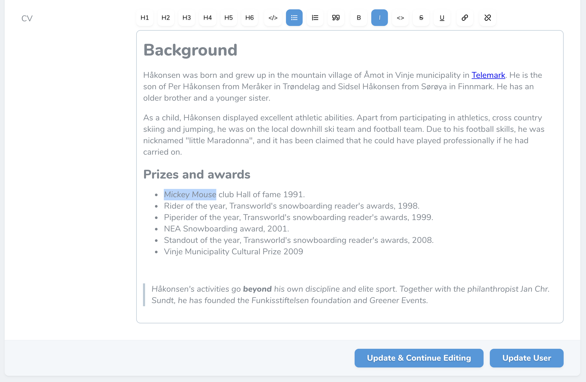

# Laravel Nova Tiptap Editor Field

A Laravel Nova implementation of the [tiptap editor for Vue.js](https://github.com/heyscrumpy/tiptap) by [@heyscrumpy](https://github.com/heyscrumpy).

## Installation

Install via composer:

```
composer require manogi/nova-tiptap
```

## Usage with default settings:

```
Tiptap::make('FieldName')
```

This will give you just the bold and italic buttons.

You will also have to add this `use` statement to the top of the file:

```
use Manogi\Tiptap\Tiptap;
```


## Usage with your selection of buttons:

```
Tiptap::make('Cv')
  ->buttons([
      'heading',
      'italic',
      'bold',
      'code',
      'link',
      'strike',
      'underline',
      'bullet_list',
      'ordered_list',
      'code_block',
      'blockquote',
  ])
  ->headingLevels(6),
```

When just passing the string `'heading'` you will have H1, H2 and H3 to choose from. You can set the level of headings by using for example `headingLevels(6)` which will give you H1 through H6.

### Note on the old way of setting heading levels

In older versions you could set the level of headings by using the object style notation like this:
`'heading' => 6,`
This is still working, but is deprecated. It will be removed in the next minor version.

### The two different "code" buttons

`'code'` is inline code (like `<code></code>`) while `'code_block'` will give you `<pre><code></code></pre>`.

## Screenshots

The tiptap editor with all the buttons:



The idea is that the editor can be themed together with the rest of Nova - here it is looking differently just by using the [Laravel Nova Stripe Theme](https://github.com/jameslkingsley/nova-stripe-theme):


## Roadmap

* Add the option to upload or choose images and add them to to the content.
* Easy option to style the text inside the editor.

## Licence

The MIT License (MIT). Please see [License File](LICENCE) for more information.
