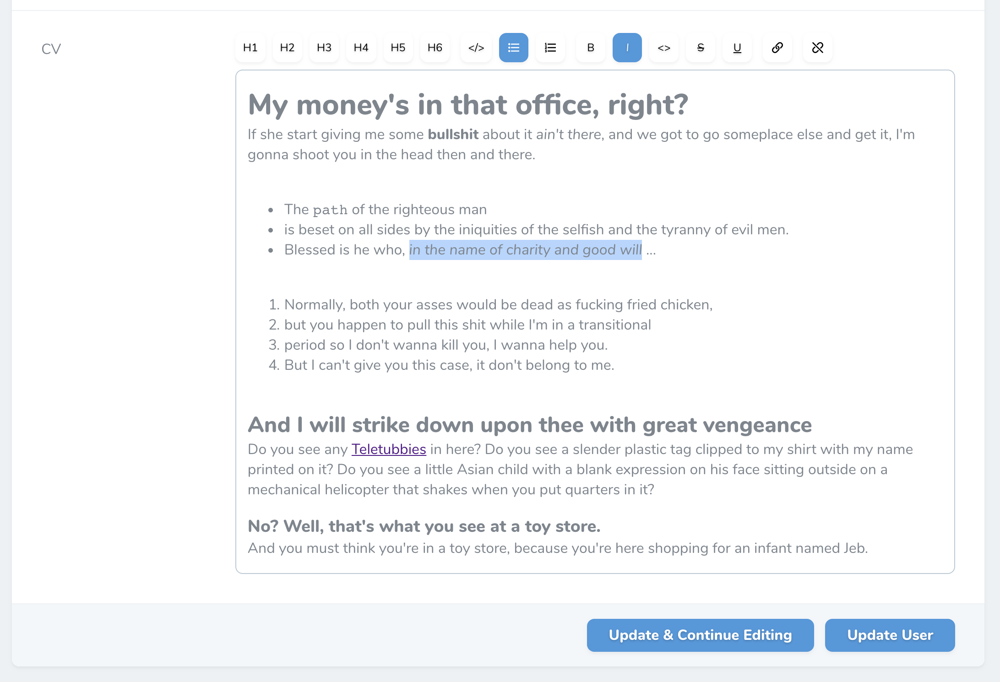

# Laravel Nova Tiptap Editor Field

A Laravel Nova implementation of the [tiptap editor for Vue.js](https://github.com/heyscrumpy/tiptap) by [@heyscrumpy](https://github.com/heyscrumpy).

## Installation

Install via composer:

```
composer require manogi/nova-tiptap
```

## Usage with default settings:

```
Tiptap::make('FieldName')
```

This will give you just the bold and italic buttons.

## Usage with your selection of buttons:

```
Tiptap::make('FieldName')
  ->buttons([
        'bold',
        'italic',
        'code',
        'link',
        'strike',
        'underline',
        'heading' => 6,
        'bullet_list',
        'ordered_list',
        'code_block',
    ])
```

When just passing the string `'heading'` you will have H1, H2 and H3 to choose from. Otherwise you can set the level of headings by passing something like for example `'heading' => 4` which will give you H1 through H4.

`'code'` is inline code (like `<code></code>`) while `'code_block'` will give you `<pre><code></code></pre>`.

## Screenshots

The tiptap editor with all the buttoms:



The idea is that the editor can be themed together with the rest of Nova - here it is looking differently just by using the [Laravel Nova Stripe Theme](https://github.com/jameslkingsley/nova-stripe-theme):


